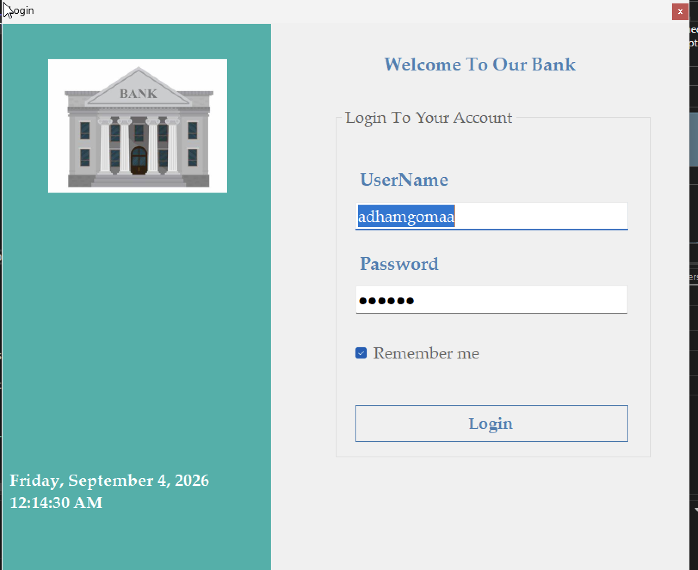
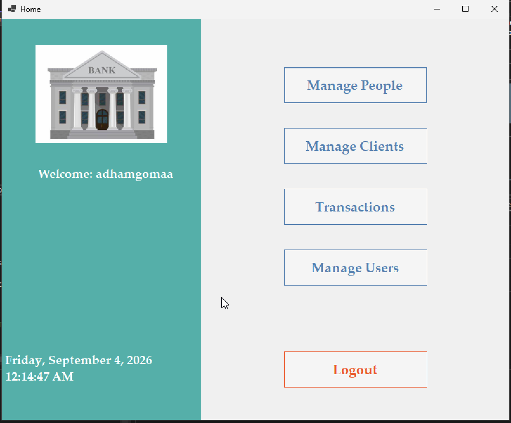
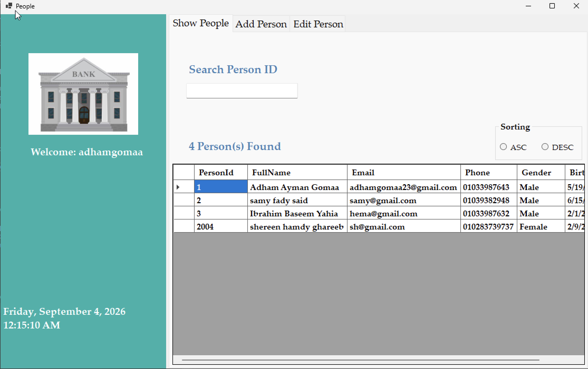
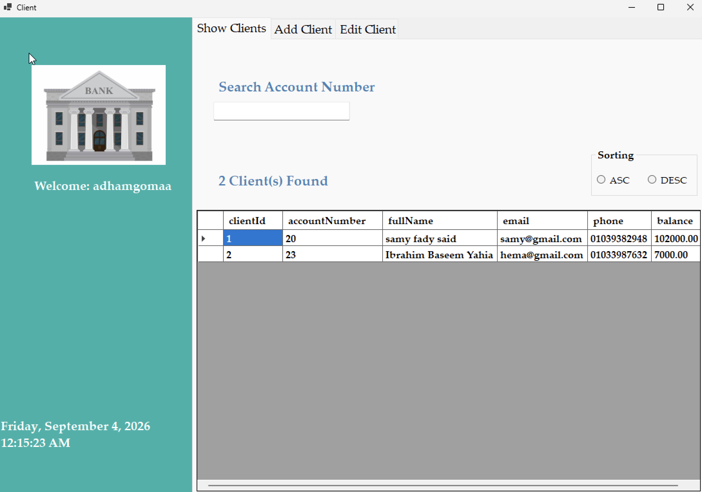
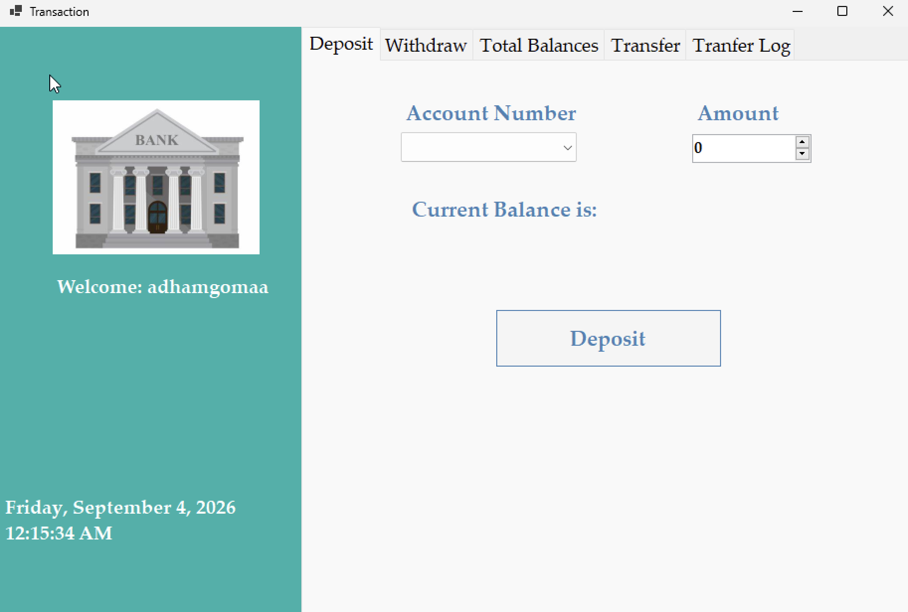
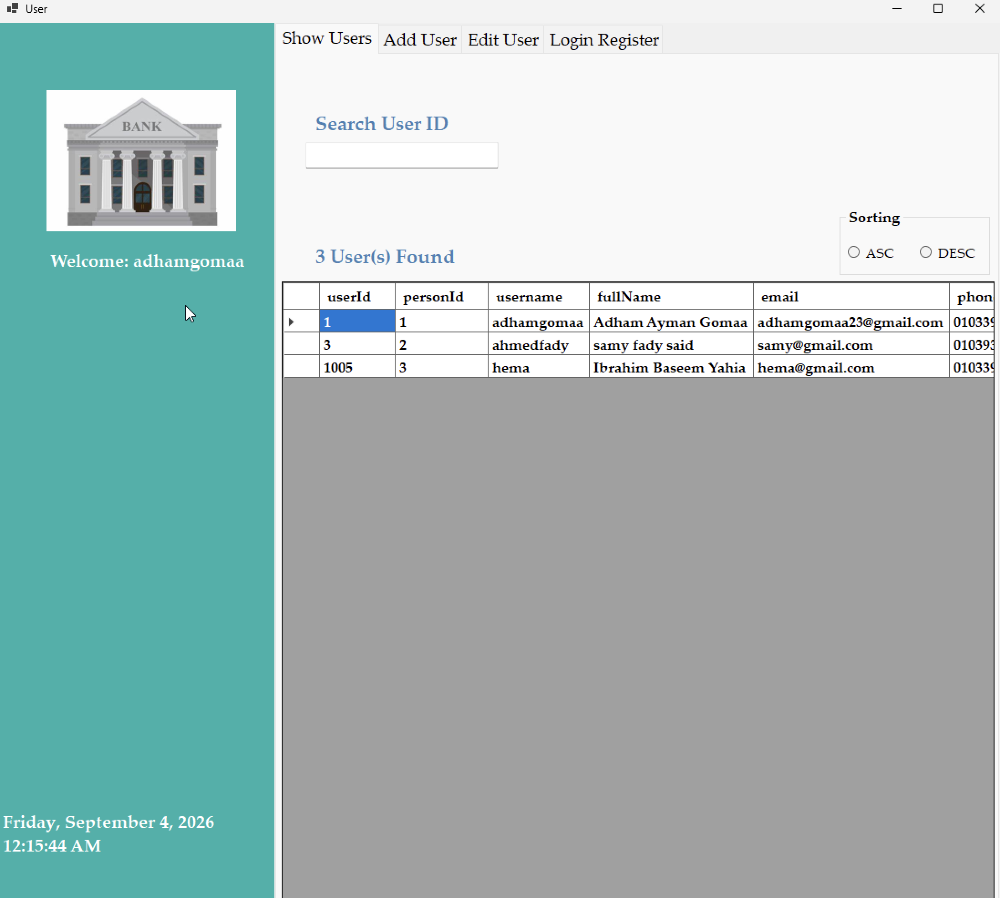

# 🏦 Bank System v2


A modern **Bank Management System** built with **C#**, **Windows Forms**, **ASP.NET Core Web API**, and **SQL Server** following a **Client-Server Architecture**.

Version 2 is a complete redesign of the original desktop application. Instead of connecting directly to the database, the WinForms client now communicates with an ASP.NET Core Web API, making the system more scalable, maintainable, and easier to extend.

---

# 📑 Table of Contents

- Overview
- Features
- Architecture
- Technologies
- Security
- Project Structure
- Database
- Screenshots
- API Modules
- Running the Project
- Future Improvements

---

# 📖 Overview

The system enables bank employees to manage:

- People
- Users
- Clients
- Bank Accounts
- Deposits
- Withdrawals
- Transfers
- Login History
- Transfer History

The project follows a layered architecture that separates presentation, business logic, data access, and communication through REST APIs.

---

# ⭐ Features

## Authentication

- Secure Login
- Remember Me
- SHA-256 Password Hashing

---

## User Management

- Add User
- Update User
- Delete User
- Search Users
- View Login History

---

## People Management

- Add Person
- Edit Person
- Search Person
- Sort Records

---

## Client Management

- Add Client
- Edit Client
- Search by Account Number
- Display Current Balance

---

## Banking Operations

- Deposit
- Withdraw
- Transfer Between Accounts
- View Transfer History
- Display Total Bank Balances

---

## Security

- User Authentication
- Permission-Based Access Control
- Password Hashing (SHA-256)
- Audit Trail

---

## Auditing

The system records:

- Login History
- Transfer Logs
- Created By
- Last Updated By
- Creation Date
- Last Update Date

---

# 🏗️ Architecture

```text
                +-------------------------+
                |     WinForms Client     |
                +-----------+-------------+
                            |
                        HttpClient
                            |
                            ▼
                +-------------------------+
                | ASP.NET Core Web API    |
                +-----------+-------------+
                            |
                   Business Layer (BL)
                            |
                            ▼
                +-------------------------+
                | Data Access Layer (DAL) |
                +-----------+-------------+
                            |
                            ▼
                     SQL Server Database
```

---

# 🛠️ Technologies Used

### Programming

- C#
- .NET 8

### Desktop

- Windows Forms

### Backend

- ASP.NET Core Web API
- RESTful APIs
- Dependency Injection

### Database

- SQL Server
- ADO.NET
- Stored Procedures
- SQL Views

### Client

- HttpClient
- DTO Pattern

### Programming Concepts

- Layered Architecture
- Client-Server Architecture
- Separation of Concerns
- Service Layer
- LINQ

### Version Control

- Git
- GitHub

---

# 🔐 Security

The application implements several security mechanisms:

- SHA-256 Password Hashing
- Login Authentication
- Permission-Based Authorization
- Audit Logging
- Separation between Client and Database through APIs

---

# 📂 Project Structure

```
BankSystem
│
├── BankSystem.Server
│   ├── API
│   ├── Business
│   ├── DataAccess
│   ├── DTOs
│   └── Shared
│
├── BankSystem.Client
│   └── WinForms
│
├── Database
│
├── Screenshots
│
└── README.md
```

---

# 🗄️ Database

Main Tables

- People
- Users
- Clients
- LoginRegister
- TransferLogs

Database Features

- Stored Procedures
- SQL Views
- Audit Information
- Relationship Constraints

---

# 🖼️ Screenshots

## Login



---

## Home



---

## People Management



---

## Client Management



---

## Transactions



---

## User Management



---

# 🚀 Running the Project

## Requirements

- Visual Studio 2022
- .NET 8 SDK
- SQL Server

---

## Clone Repository

```bash
git clone https://github.com/YourUsername/BankSystem.git
```

---

## Database

Restore the database using the SQL script located inside:

```
Database/
```

---

## Configure Server

Update the connection string inside:

```
appsettings.json
```

Example:

```json
"ConnectionStrings": {
    "DefaultConnection": "Your SQL Server Connection String"
}
```

---

## Run

1. Start the API.
2. Run the WinForms Client.
3. Login.
4. Enjoy the system.

---

# 🌟 Version 2 Improvements

Compared to Version 1:

- Client-Server Architecture
- RESTful APIs
- HttpClient Communication
- DTO Layer
- Dependency Injection
- Better Separation of Concerns
- Configurable Settings using appsettings.json
- Improved Maintainability
- Easier Future Expansion

---

# 👨‍💻 Author

**Adham Gomaa**

GitHub: https://github.com/YourUsername

---

⭐ If you like this project, don't forget to give it a star!